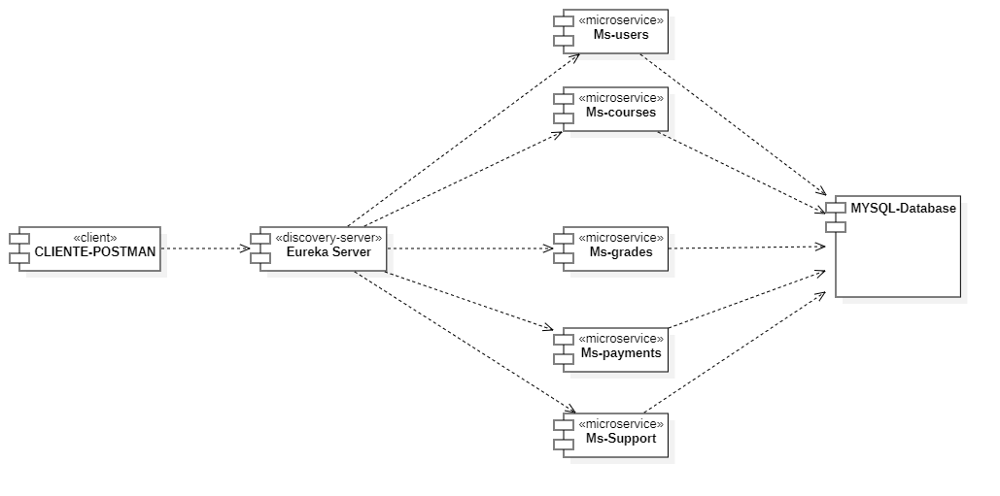

# Sistema de Gestión de Clases EduTech Innovators

## 📋 Descripción
Proyecto de microservicios para la gestión completa de una plataforma educativa, incluyendo usuarios, cursos, calificaciones, pagos y soporte técnico.

## 👥 Integrantes
- **Giancarlo Ovalle**
- **Agustin Moya** 
- **Vicente Castro**

## 🏗️ Arquitectura del Sistema



*Diagrama de arquitectura mostrando la comunicación entre microservicios*

### Componentes Principales:
- **Cliente/Postman**: Interfaz para pruebas y consumo de APIs
- **Eureka Server**: Servidor de descubrimiento de servicios
- **Microservicios**: 5 servicios independientes especializados
- **MySQL Database**: Base de datos centralizada

## 🚀 Microservicios

| Servicio | Puerto | Descripción | Estado |
|----------|--------|-------------|--------|
| **eureka** | 8761 | Servidor de descubrimiento | ✅ Funcional |
| **ms-users** | 9002 | Gestión de usuarios y roles | ✅ Funcional |
| **ms-courses** | 9001 | Gestión de cursos y categorías | ✅ Funcional |
| **ms-grades** | 9003 | Calificaciones de estudiantes | ✅ Funcional |
| **ms-payments** | 9004 | Procesamiento de pagos | ✅ Funcional |
| **ms-support** | 9005 | Tickets de soporte técnico | ✅ Funcional |

## 🛠️ Tecnologías Utilizadas
- **Backend**: Spring Boot 3.5.3, Spring Cloud
- **Base de Datos**: MySQL 8.0
- **Service Discovery**: Netflix Eureka
- **ORM**: JPA/Hibernate 6.6.18
- **Build Tool**: Maven 3.9.10
- **Java**: OpenJDK 21

## 📦 Instalación y Ejecución

### Prerrequisitos
- Java 21
- Maven 3.9+
- MySQL 8.0
- Git

### Pasos de Instalación

1. **Clonar el repositorio**
```bash
git clone https://github.com/Speedwaton/edutech-microservices.git
cd edutech-microservices
```

2. **Configurar la base de datos**
```bash
mysql -u root -p < create-db.sql
```

3. **Compilar todos los proyectos**
```bash
compile.bat
```

4. **Ejecutar todos los microservicios**
```bash
run-all.bat
```

### Ejecución Individual
```bash
# Eureka Server (DEBE iniciarse primero)
run-eureka.bat

# Microservicios individuales
run-users.bat
run-courses.bat 
run-grades.bat
run-payments.bat
run-support.bat
```

## 📋 Testing con Postman

Importa la colección completa: [`Edutech_Complete_Postman_Collection.json`](Edutech_Complete_Postman_Collection.json)

### Variables de Entorno
```
eureka_base_url = http://localhost:8761
users_base_url = http://localhost:9002
courses_base_url = http://localhost:9001
grades_base_url = http://localhost:9003
payments_base_url = http://localhost:9004
support_base_url = http://localhost:9005
```

## 🔗 Endpoints Principales

### MS-Users (Puerto 9002)
- `GET/POST/PUT/DELETE /api/users` - CRUD de usuarios
- `GET/POST/PUT/DELETE /api/roles` - CRUD de roles

### MS-Courses (Puerto 9001)
- `GET/POST/PUT/DELETE /api/courses` - CRUD de cursos
- `GET/POST/PUT/DELETE /api/course-categories` - CRUD de categorías

### MS-Grades (Puerto 9003)
- `GET/POST/PUT/DELETE /api/student-marks` - CRUD de calificaciones
- `GET /api/student-marks/student/{id}` - Calificaciones por estudiante
- `GET /api/student-marks/quiz/{id}` - Calificaciones por quiz

### MS-Payments (Puerto 9004)
- `GET/POST/PUT/DELETE /api/payments` - CRUD de pagos

### MS-Support (Puerto 9005)
- `GET/POST/PUT/DELETE /api/support-tickets` - CRUD de tickets
- `GET /api/support-tickets/user/{id}` - Tickets por usuario
- `GET /api/support-tickets/status/{status}` - Tickets por estado

## 📊 Monitoreo

### Eureka Dashboard
Accede a: http://localhost:8761

### Health Checks
- Users: http://localhost:9002/actuator/health
- Courses: http://localhost:9001/actuator/health
- Grades: http://localhost:9003/actuator/health
- Payments: http://localhost:9004/actuator/health
- Support: http://localhost:9005/actuator/health

## 🗃️ Estructura del Proyecto

```
edutech-microservices/
├── eureka/                 # Servidor Eureka
├── common/                 # DTOs compartidos
├── ms-users/              # Microservicio de usuarios
├── ms-courses/            # Microservicio de cursos  
├── ms-grades/             # Microservicio de calificaciones
├── ms-payments/           # Microservicio de pagos
├── ms-support/            # Microservicio de soporte
├── docs/images/           # Diagramas y documentación visual
├── create-db.sql          # Script de base de datos
├── run-all.bat           # Ejecutar todos los servicios
├── compile.bat           # Compilar todos los proyectos
└── Edutech_Complete_Postman_Collection.json
```

## 📋 Documentación Técnica

- [📊 Diagrama de Arquitectura](ARQUITECTURA.md)
- [🗄️ Diagrama de Base de Datos](DIAGRAMA_BD.md)
- [🧪 Guía de Testing](TESTING_GUIDE.md)

## 🎯 Estado del Proyecto

✅ **COMPLETAMENTE FUNCIONAL**

- Todos los microservicios compilando y ejecutándose correctamente
- Base de datos configurada y funcionando
- Endpoints CRUD implementados y probados
- Colección Postman completa y verificada
- Documentación técnica actualizada
- Scripts de automatización funcionando
- Diagramas de arquitectura profesionales

## 📞 Soporte

Para soporte técnico o preguntas sobre el proyecto, contacta al equipo de desarrollo.